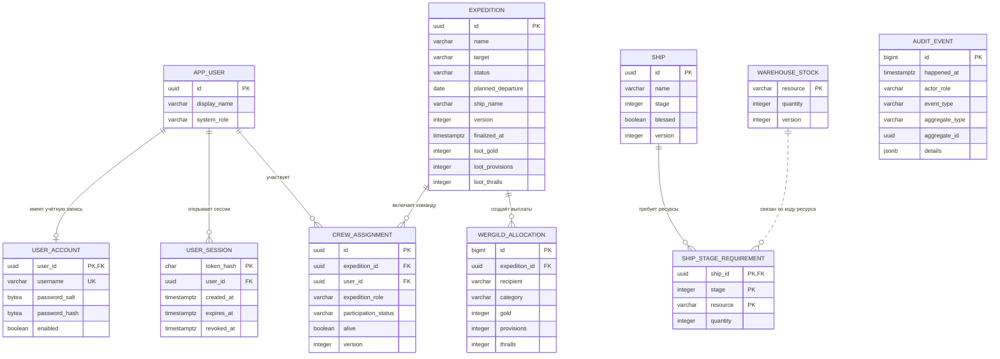

# Схема базы данных Drakkar ERP Soft

База данных работает на PostgreSQL 16. Flyway создаёт схему автоматически при запуске приложения. Исходной версией схемы считается SQL-миграция [`V1__architecture_slice.sql`](../backend/src/main/resources/db/migration/V1__architecture_slice.sql).

## ER-схема



## Как данные сгруппированы

| Область | Таблицы | Назначение |
|---|---|---|
| Пользователи и авторизация | `app_user`, `user_account`, `user_session` | пользователь, его роль, данные входа и активные сессии |
| Походы | `expedition`, `crew_assignment`, `wergild_allocation` | план похода, состав команды, добыча и распределение Вергельда |
| Верфь | `ship`, `ship_stage_requirement`, `warehouse_stock` | состояние корабля, требования этапов и остатки ресурсов |
| История | `audit_event` | журнал ключевых действий |

Служебную таблицу `flyway_schema_history` создаёт Flyway: в ней хранится список уже применённых миграций.

`audit_event` намеренно не имеет внешнего ключа на конкретную бизнес-таблицу: поля `aggregate_type` и `aggregate_id` позволяют хранить историю для разных типов объектов даже после изменения их структуры.

Связь между `ship_stage_requirement.resource` и `warehouse_stock.resource` логическая. При завершении этапа сервис блокирует нужные строки склада, проверяет остатки и в одной транзакции списывает ресурсы и меняет этап корабля.

Поля `expedition.ship_name` и `wergild_allocation.recipient` хранят снимок текста на момент операции. Это позволяет истории похода не зависеть от последующего переименования корабля или пользователя.

После утверждения итогов похода триггер `expedition_results_immutable` запрещает изменять статус, добычу и дату фиксации даже прямым SQL-запросом.

## Как посмотреть работающую базу

После запуска проекта список таблиц можно получить так:

```bash
cd soft
docker compose exec postgres psql -U drakkar -d drakkar -c '\dt'
```

Описание конкретной таблицы:

```bash
docker compose exec postgres psql -U drakkar -d drakkar -c '\d expedition'
```

В проекте нет отдельной административной панели для БД: ER-схема предназначена для чтения, а SQL-миграция остаётся точным исполняемым описанием.
