# Схема базы данных Drakkar ERP Soft

База данных работает на PostgreSQL 16. Flyway создаёт и обновляет схему автоматически при запуске приложения. Исполняемые версии находятся в каталоге [`db/migration`](../backend/src/main/resources/db/migration): `V1` создаёт исходный срез, `V2` добавляет поселения, `V3` закрепляет аккаунт за одним поселением, `V4` расширяет демо-данные, `V5` добавляет флот, рецепты кораблей, заказы верфи и второе демонстрационное поселение, а `V6` — параллельные походы и возможность отвязать строящийся корабль от похода.

## ER-схема

```mermaid
erDiagram
    APP_USER ||--o| USER_ACCOUNT : "имеет учётную запись"
    APP_USER ||--o{ USER_SESSION : "открывает сессии"
    APP_USER ||--|| SETTLEMENT_MEMBERSHIP : "принадлежит"
    SETTLEMENT ||--o{ SETTLEMENT_MEMBERSHIP : "включает пользователей"
    SETTLEMENT ||--o{ USER_SESSION : "зафиксировано в сессии"
    SETTLEMENT ||--o{ EXPEDITION : "содержит походы"
    SETTLEMENT ||--o{ WAREHOUSE_STOCK : "имеет склад"
    SETTLEMENT ||--o{ SHIP : "имеет корабли"
    SETTLEMENT ||--o{ AUDIT_EVENT : "имеет историю"
    APP_USER ||--o{ CREW_ASSIGNMENT : "участвует"
    EXPEDITION ||--o{ CREW_ASSIGNMENT : "включает команду"
    EXPEDITION ||--o{ WERGILD_ALLOCATION : "создаёт выплаты"
    EXPEDITION ||--o{ EXPEDITION_SHIP : "получает корабли"
    SHIP ||--o{ EXPEDITION_SHIP : "участвует в походах"
    EXPEDITION ||--o{ SHIP_BUILD_REQUEST : "запрашивает строительство"
    SHIP ||--o| SHIP_BUILD_REQUEST : "строится по заказу"
    SHIP_TYPE ||--o{ SHIP : "определяет вместимость"
    SHIP_TYPE ||--o{ SHIP_TYPE_REQUIREMENT : "имеет рецепт"
    SHIP ||--o{ SHIP_STAGE_REQUIREMENT : "требует ресурсы"
    WAREHOUSE_STOCK ||..o{ SHIP_STAGE_REQUIREMENT : "связан по поселению и ресурсу"

    SETTLEMENT {
        uuid id PK
        varchar name
        timestamptz created_at
    }

    SETTLEMENT_MEMBERSHIP {
        uuid settlement_id PK, FK
        uuid user_id PK, FK, UK
        varchar member_role
        timestamptz joined_at
    }

    APP_USER {
        uuid id PK
        varchar display_name
    }

    USER_ACCOUNT {
        uuid user_id PK, FK
        varchar username UK
        bytea password_salt
        bytea password_hash
        boolean enabled
    }

    USER_SESSION {
        char token_hash PK
        uuid user_id FK
        uuid active_settlement_id FK
        timestamptz created_at
        timestamptz expires_at
        timestamptz revoked_at
    }

    EXPEDITION {
        uuid id PK
        uuid settlement_id FK
        varchar name
        varchar target
        varchar status
        date planned_departure
        integer required_capacity
        integer version
        timestamptz finalized_at
        integer loot_gold
        integer loot_provisions
        integer loot_thralls
    }

    CREW_ASSIGNMENT {
        uuid id PK
        uuid expedition_id FK "может быть NULL после снятия с похода"
        uuid user_id FK
        varchar expedition_role
        varchar participation_status
        boolean alive
        integer version
    }

    WAREHOUSE_STOCK {
        uuid settlement_id PK, FK
        varchar resource PK
        integer quantity
        integer version
    }

    SHIP {
        uuid id PK
        uuid settlement_id FK
        varchar name
        varchar ship_type_code FK
        integer stage
        boolean blessed
        integer version
    }

    SHIP_STAGE_REQUIREMENT {
        uuid ship_id PK, FK
        integer stage PK
        varchar resource PK
        integer quantity
    }

    SHIP_TYPE {
        varchar code PK
        varchar name
        integer capacity
    }

    SHIP_TYPE_REQUIREMENT {
        varchar ship_type_code PK, FK
        integer stage PK
        varchar resource PK
        integer quantity
    }

    EXPEDITION_SHIP {
        uuid expedition_id PK, FK
        uuid ship_id PK, FK
        timestamptz assigned_at
    }

    SHIP_BUILD_REQUEST {
        uuid id PK
        uuid settlement_id FK
        uuid expedition_id FK
        varchar ship_type_code FK
        uuid ship_id FK, UK
        uuid requested_by FK
        varchar status
        timestamptz created_at
    }

    WERGILD_ALLOCATION {
        bigint id PK
        uuid expedition_id FK
        varchar recipient
        varchar category
        integer gold
        integer provisions
        integer thralls
    }

    AUDIT_EVENT {
        bigint id PK
        uuid settlement_id FK
        timestamptz happened_at
        varchar actor_role
        varchar event_type
        varchar aggregate_type
        uuid aggregate_id
        jsonb details
    }
```



## Изоляция поселений

`settlement` — корень клиентского пространства. Каждая учётная запись связана ровно с одним поселением через `settlement_membership`; уникальное ограничение на `user_id` запрещает добавить пользователя во второе. Роль хранится в этой же связи.

При успешном входе сервер находит членство по логину и автоматически записывает его `settlement_id` в `user_session.active_settlement_id`. Пользователь не выбирает поселение и не получает список других пространств.

Походы, склад, корабли, заказы и аудит содержат `settlement_id`. Состав команды, флот и распределение Вергельда наследуют принадлежность через `expedition`, требования этапов — через `ship`. Все прикладные запросы получают идентификатор поселения из проверенной серверной сессии и используют его в условиях чтения и изменения. Идентификатор не принимается из тела бизнес-запроса.

Доступность участника вычисляется по `crew_assignment` вместе со статусом связанного `expedition`: назначения `PENDING` и `CONFIRMED` в походах `PREPARATION` или `SAILING` делают жителя занятым. Членство жителя блокируется на время операции назначения, поэтому два параллельных запроса не могут отправить его в разные активные походы. `DECLINED` и завершённый поход больше не блокируют новое назначение.

Склад имеет составной первичный ключ `(settlement_id, resource)`: одинаковый ресурс существует отдельно у каждого клиента. Защищённая операция подключения поселения атомарно добавляет пространство, нового пользователя, его учётную запись с ролью ярла и пустые складские позиции.

## Как данные сгруппированы

| Область | Таблицы | Назначение |
|---|---|---|
| Поселения | `settlement`, `settlement_membership` | клиентские пространства, пользователи и роли внутри них |
| Авторизация | `app_user`, `user_account`, `user_session` | пользователь, данные входа, автоматически назначенное поселение и серверные сессии |
| Походы | `expedition`, `crew_assignment`, `expedition_ship`, `wergild_allocation` | план похода, команда, флот, добыча и Вергельд |
| Верфь | `ship_type`, `ship_type_requirement`, `ship_build_request`, `ship`, `ship_stage_requirement` | каталог типов, рецепты, заказы и состояние строительства |
| Склад | `warehouse_stock` | отдельные остатки каждого поселения |
| История | `audit_event` | события, которые API прикрепляет к карточке соответствующего похода |

Служебную таблицу `flyway_schema_history` создаёт Flyway: в ней хранится список применённых миграций.

`audit_event` намеренно не имеет внешнего ключа на конкретную бизнес-таблицу: поля `aggregate_type` и `aggregate_id` позволяют хранить историю объектов разных типов. Поле `settlement_id` ограничивает журнал текущим клиентом.

`ship_type_requirement` — нормативный рецепт типа корабля. При запросе строительства рецепт копируется в `ship_stage_requirement`, поэтому уже созданный заказ не меняется при будущей корректировке справочника. При завершении этапа сервис выбирает склад активного поселения, блокирует нужные строки и в одной транзакции списывает ресурсы, меняет этап и добавляет аудит.

`expedition_ship` реализует связь многие-ко-многим: один поход получает несколько кораблей, а готовый корабль после завершения старого похода может использоваться снова. Готовая вместимость считается только по кораблям на этапе `4`, плановая — по всем назначенным кораблям. После утверждения итогов триггер `expedition_results_immutable` запрещает изменять статус, добычу и дату фиксации даже прямым SQL-запросом.

## Как посмотреть работающую базу

После запуска проекта список таблиц можно получить так:

```bash
cd soft
docker compose exec postgres psql -U drakkar -d drakkar -c '\dt'
```

Описание таблиц поселений и походов:

```bash
docker compose exec postgres psql -U drakkar -d drakkar -c '\d settlement'
docker compose exec postgres psql -U drakkar -d drakkar -c '\d expedition'
docker compose exec postgres psql -U drakkar -d drakkar -c '\d expedition_ship'
docker compose exec postgres psql -U drakkar -d drakkar -c '\d ship_build_request'
```

Проверка количества походов по поселениям:

```bash
docker compose exec postgres psql -U drakkar -d drakkar -c \
  'select s.name, count(e.id) from settlement s left join expedition e on e.settlement_id = s.id group by s.id order by s.name;'
```

В проекте нет отдельной административной панели для БД: ER-схема предназначена для чтения, а SQL-миграции остаются точным исполняемым описанием.
