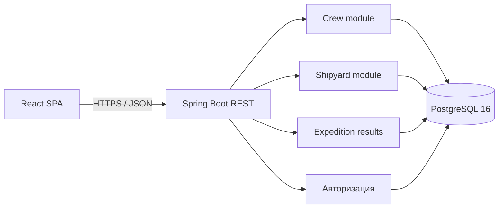
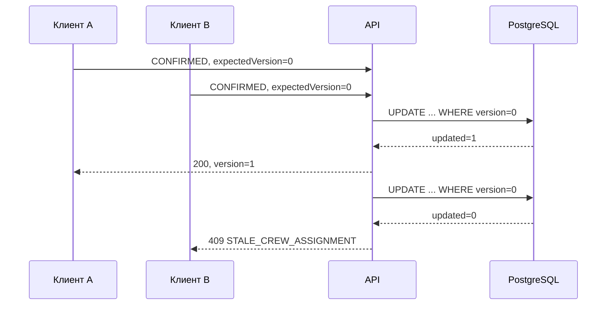
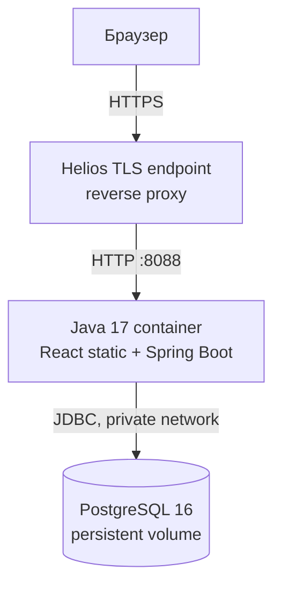

# Software Architecture Document: Drakkar ERP Soft

## 1. Цель архитектурного прототипа

Soft реализует не максимальное число функций, а сквозные сценарии, которые проверяют архитектурные риски системы: конкурентный доступ, транзакционную целостность, неизменяемость утверждённых данных, аутентификацию и ролевую авторизацию.

## 2. Архитектурно значимые требования

| Риск / механизм | Трассировка | Реализация |
|---|---|---|
| Два клиента меняют одно назначение | UC7, FR-11, NFR-09 | optimistic locking по `version`; второй запрос получает 409 |
| Склад и этап корабля не должны расходиться | UC11, FR-18, NFR-08, NFR-09 | блокировка строк `FOR UPDATE` + одна ACID-транзакция |
| Финальный этап требует Блот | UC11/UC12, FR-20 | сервер отклоняет переход независимо от UI |
| После фиксации итоги нельзя переписать | UC4, FR-21–FR-25 | проверка application service + trigger PostgreSQL |
| Операции доступны только авторизованной роли | NFR-02 | серверная сессия, роли и проверка личности воина |
| Нужна история ключевых изменений | NFR-11 | append-only журнал `audit_event` |

## 3. Архитектурный стиль

Выбран **модульный монолит**. Для учебного контура и Helios он даёт простое развёртывание одним Java-процессом, но сохраняет границы модулей. Микросервисы не выбраны: они усложнили бы транзакции между складом, верфью и походами, не давая выгоды при текущем масштабе.



## 4. Компоненты

| Компонент | Ответственность | Граница |
|---|---|---|
| React SPA | ролевые экраны и демонстрация конфликтов | не содержит бизнес-правил; решения всегда принимает сервер |
| Авторизация | проверка пароля, выдача и проверка сессии | PBKDF2-SHA256, 210 000 итераций; сырой токен не хранится |
| Crew service | назначение и ответ воина | сериализует назначения одного жителя; проверяет версию |
| Shipyard service | закрытие этапа и списание склада | одна транзакция; строки склада блокируются в детерминированном порядке |
| Expedition service | preview и фиксация итогов | в одной транзакции фиксирует потери, добычу, выплаты, склад и статус |
| Audit writer | append-only след изменений | запись события входит в ту же транзакцию, что и операция |

## 5. Защита данных

### 5.1 Конкурентное подтверждение



### 5.2 Закрытие этапа корабля

```mermaid
sequenceDiagram
    participant UI
    participant S as ShipyardService
    participant DB as PostgreSQL
    UI->>S: completeStage(ship, version)
    S->>DB: BEGIN; lock ship
    S->>DB: lock required warehouse rows
    alt ресурсов достаточно
        S->>DB: decrement stock; increment stage; audit
        S->>DB: COMMIT
        S-->>UI: 200
    else есть дефицит
        S->>DB: ROLLBACK
        S-->>UI: 409 INSUFFICIENT_STOCK
    end
```

### 5.3 Неизменяемость

Первый уровень — `ExpeditionService`, который разрешает фиксацию только для `SAILING` и `finalized_at IS NULL`. Второй уровень — trigger `expedition_results_immutable`, который запрещает обход правила прямым SQL-запросом.

## 6. Авторизация

1. Клиент передаёт логин и пароль по HTTPS.
2. Сервер считает PBKDF2-HMAC-SHA256 с индивидуальной 128-битной солью и 210 000 итераций.
3. Хеш сравнивается в постоянном времени.
4. При успехе сервер создаёт 256-битный случайный opaque-токен. Клиент получает сырой токен, а PostgreSQL — только SHA-256 хеш.
5. Каждый API-запрос проходит фильтр сессии, затем role guard. Для ответа воина также проверяется `assignment.user_id == session.user_id`.
6. Выход помечает сессию отозванной; повторное использование токена возвращает `401 SESSION_INVALID`.

До публичного запуска нужно добавить rate limiting входа, ротацию/восстановление пароля, автоматическую очистку истёкших сессий и CSRF-стратегию, если токен будет перенесён в cookie.

## 7. Развёртывание



В runtime проекта нужны только Java 17 и PostgreSQL 16; TLS завершается штатным входным контуром Helios. Локальная демонстрация доступна по HTTP на `localhost:8088`. Flyway применяет схему при старте. Том PostgreSQL обеспечивает сохранность между перезапусками.

Подробная структура таблиц и связей вынесена в [ER-схему базы данных](Database%20Schema.md). Исполняемым источником схемы остаётся миграция [`V1__architecture_slice.sql`](../backend/src/main/resources/db/migration/V1__architecture_slice.sql).

## 8. Верификация

Автотесты проверяют:

- детерминированное распределение Вергельда и целочисленные остатки;
- вход по паролю и отсутствие сырого session token в БД;
- отзыв токена при выходе и отказ в его повторном использовании;
- фильтрацию представления данных по роли на уровне HTTP API;
- отклонение устаревшего ответа воина;
- rollback склада и этапа при дефиците;
- обязательность благословения перед последним этапом корабля;
- атомарную фиксацию итогов;
- отказ trigger-а изменить утверждённую добычу.

Интеграционные тесты выполняются на реальном PostgreSQL 16 в Testcontainers, а не на поведенчески отличающейся in-memory БД.
